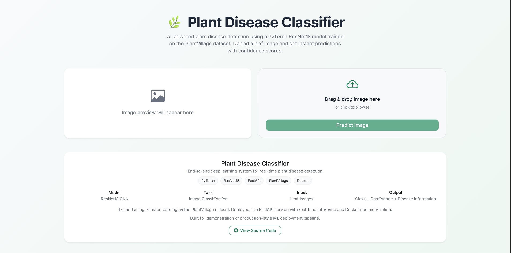
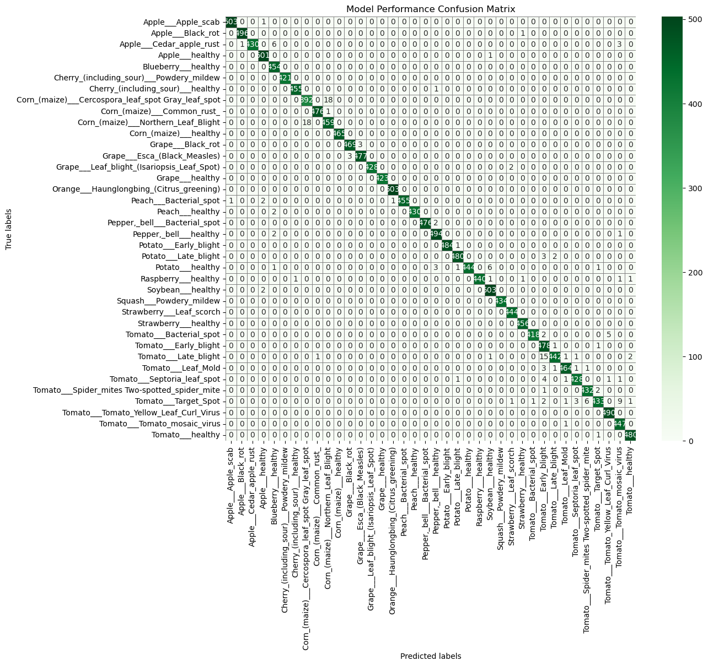
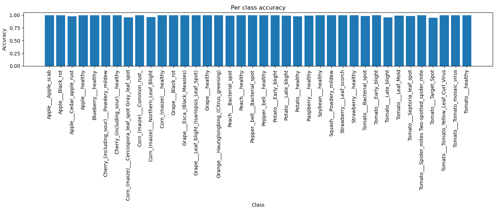
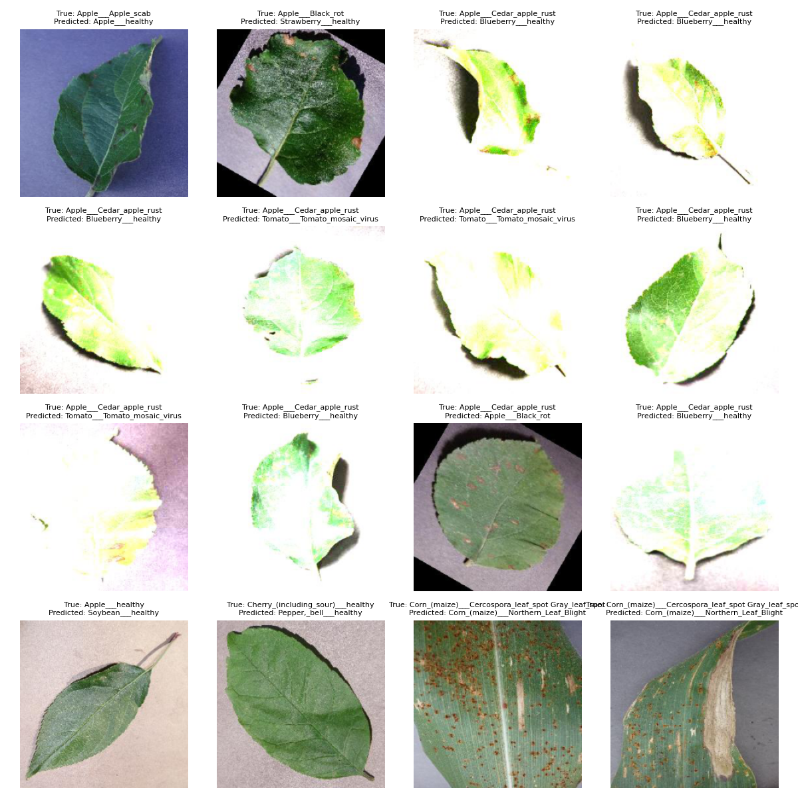
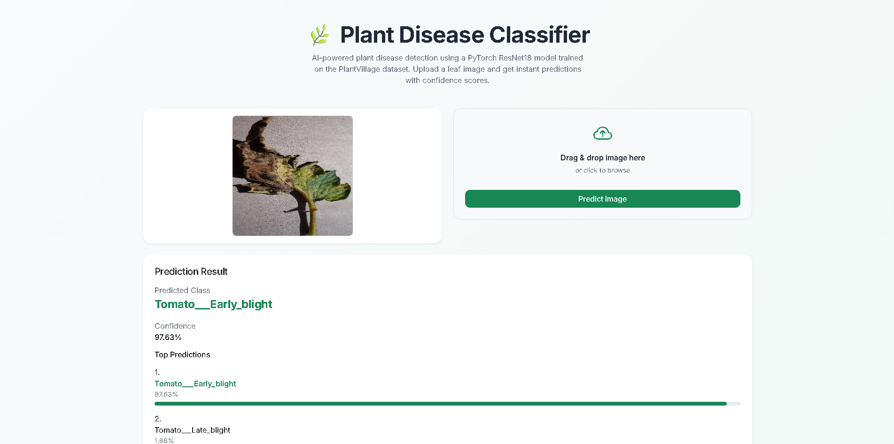
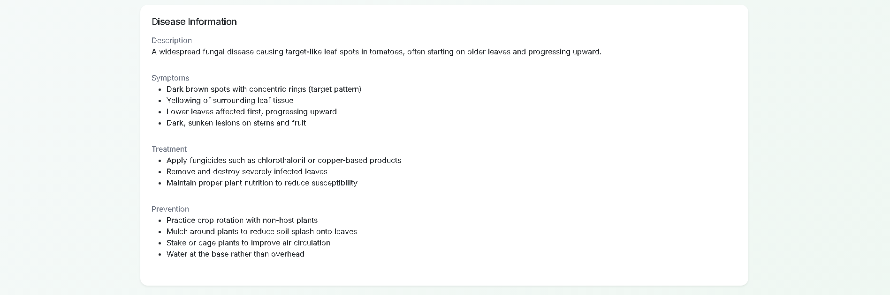
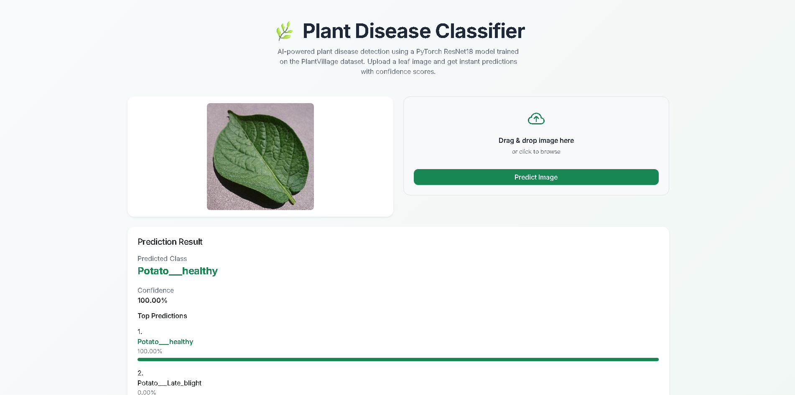
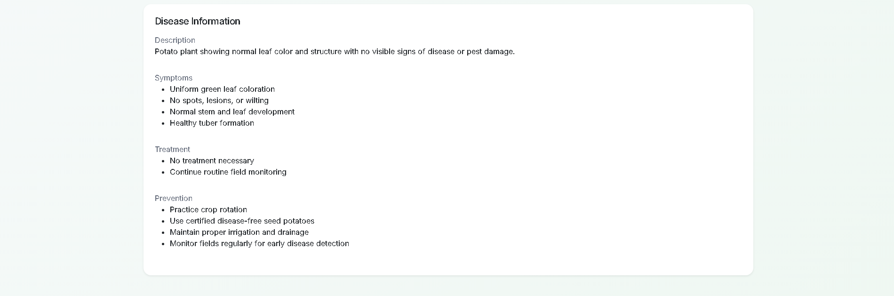

<p align="center">
  
</p>

<h1 align="center">🌿 Plant Disease Classifier</h1>

<p align="center">
  <b>Dockerized Plant Disease Classification Web App using PyTorch</b>
</p>

<p align="center">
  Upload a leaf image → get an instant AI-powered disease diagnosis with confidence scores, symptoms, treatment, and prevention — all from your browser.
</p>

<p align="center">
  
  
  
  
  
  
</p>

---

## 📋 Table of Contents

- [Problem Statement](#-problem-statement)
- [Key Features](#-key-features)
- [Tech Stack](#hammer_and_wrench-tech-stack)
- [System Architecture](#building_construction-system-architecture)
- [Model Details](#-model-details)
- [Training Results & Metrics](#-training-results--metrics)
- [Model Predictions & UI Demo](#framed_picture-model-predictions--ui-demo)
- [Try It Yourself](#-try-it-yourself)
- [Getting Started (Docker)](#-getting-started-docker)
- [Project Structure](#-project-structure)
- [API Reference](#-api-reference)
- [Testing](#-testing)
- [Future Improvements](#-future-improvements)
- [License](#-license)

---

## 🧩 Problem Statement

Crop diseases cause billions of dollars in agricultural losses worldwide every year. Smallholder farmers, who grow the majority of the world's food, often lack the expertise or resources to identify diseases early enough to take corrective action.

**This project addresses that gap.** It provides a fast, accessible, and accurate plant disease detection system that works through a simple web interface — no agronomist required. A farmer or field technician can photograph a plant leaf, upload it through the browser, and receive:

- The specific disease classification
- Confidence scores for the top-5 most likely diagnoses
- Actionable disease information: symptoms, cause, treatment, and prevention

All of this runs locally in a single Docker container — no cloud dependency, no API keys, no internet required after setup.

---

## ✨ Key Features

| Feature | Description |
|---|---|
| 🖼️ **Image-Based Classification** | Upload any leaf photo (JPEG, PNG, WebP) for instant analysis |
| 🧠 **Deep Learning Model** | ResNet18 with transfer learning, fine-tuned on PlantVillage dataset |
| 🌐 **Web UI** | Clean, responsive drag-and-drop interface built with Bootstrap 5 |
| 🐳 **One-Command Docker Deployment** | `docker build` + `docker run` — production-ready in seconds |
| 📊 **Top-5 Predictions** | Ranked predictions with color-coded confidence bars |
| 📋 **Disease Intelligence** | Rich metadata: symptoms, cause, treatment & prevention for every class |
| 🩺 **Health Check Endpoint** | Built-in `/health` route for monitoring and orchestration |
| 🧪 **Built-In Example Images** | 10 sample leaf images for immediate testing — no dataset download needed |
| ✅ **Automated Tests** | Pytest suite covering success paths, edge cases, and error handling |

---

## :hammer_and_wrench: Tech Stack

| Layer | Technology |
|---|---|
| **Deep Learning** | PyTorch 2.5, torchvision 0.20 |
| **Model Architecture** | ResNet18 (ImageNet pretrained, fine-tuned) |
| **Backend API** | FastAPI 0.139 + Uvicorn |
| **Frontend** | HTML5, CSS3, JavaScript (Bootstrap 5, Inter font) |
| **Data Validation** | Pydantic v2 |
| **Image Processing** | Pillow (PIL) |
| **Evaluation** | scikit-learn, Matplotlib, Seaborn |
| **Containerization** | Docker (Python 3.12-slim base) |
| **Testing** | pytest + FastAPI TestClient |

---

## :building_construction: System Architecture

```
┌─────────────────────────────────────────────────────────────────┐
│                        Docker Container                         │
│                                                                 │
│  ┌──────────┐    ┌──────────────┐    ┌──────────────────────┐   │
│  │          │    │              │    │                      │   │
│  │  Web UI  │───▶│  FastAPI     │───▶│  PyTorch ResNet18   │   │
│  │  (HTML/  │    │  Backend     │    │  Inference Engine    │   │
│  │  CSS/JS) │◀───│  /predict    │◀───│                     │   │
│  │          │    │              │    │  ┌────────────────┐  │   │
│  └──────────┘    └──────────────┘    │  │ Disease Meta-  │  │   │
│                                      │  │ data (JSON)    │  │   │
│       User uploads                   │  └────────────────┘  │   │
│       leaf image                     └──────────────────────┘   │
│                                                                 │
│  Flow: Image → Resize 224×224 → Normalize → Model → Softmax     │
│        → Top-5 Predictions + Disease Info → JSON → UI Render    │
└─────────────────────────────────────────────────────────────────┘
```

**Request lifecycle:**

1. User drags/drops or selects a leaf image in the **Web UI**
2. Frontend sends a `POST /predict` request with the image as `multipart/form-data`
3. **FastAPI backend** validates file type (JPEG/PNG/WebP) and decodes the image
4. Image is resized to **224×224**, converted to tensor, and normalized with **ImageNet statistics**
5. **ResNet18 model** performs a forward pass; softmax produces class probabilities
6. Top-5 predictions are extracted, enriched with **disease metadata** (symptoms, treatment, etc.)
7. Structured JSON response is returned and **rendered visually** in the browser

---

## 🧠 Model Details

### Architecture

- **Base Model:** `torchvision.models.resnet18` with `ResNet18_Weights.DEFAULT` (ImageNet pretrained)
- **Transfer Learning Strategy:** Backbone frozen except `layer4` + custom fully-connected head
- **Classifier Head:** `nn.Linear(512, 38)` — maps 512 ResNet features to 38 plant disease classes
- **Training Config:** Adam optimizer, `lr=1e-3`, `CrossEntropyLoss`, 5 epochs, batch size 32

### Input Preprocessing

| Step | Detail |
|---|---|
| Resize | `224 × 224` pixels |
| Conversion | PIL Image → PyTorch tensor (`float32`, scaled 0–1) |
| Normalization | ImageNet mean `[0.485, 0.456, 0.406]`, std `[0.229, 0.224, 0.225]` |

### Training Augmentations

| Augmentation | Configuration |
|---|---|
| `RandomHorizontalFlip` | 50% probability |
| `RandomRotation` | ±10 degrees |

### Output Classes (38 Total)

The model classifies **14 crop species** across **38 classes** (26 diseases + 12 healthy states):

<details>
<summary><b>View all 38 classes</b></summary>

| # | Class | Crop | Status |
|---|---|---|---|
| 0 | Apple___Apple_scab | Apple | Diseased |
| 1 | Apple___Black_rot | Apple | Diseased |
| 2 | Apple___Cedar_apple_rust | Apple | Diseased |
| 3 | Apple___healthy | Apple | Healthy |
| 4 | Blueberry___healthy | Blueberry | Healthy |
| 5 | Cherry_(including_sour)___Powdery_mildew | Cherry | Diseased |
| 6 | Cherry_(including_sour)___healthy | Cherry | Healthy |
| 7 | Corn_(maize)___Cercospora_leaf_spot Gray_leaf_spot | Corn | Diseased |
| 8 | Corn_(maize)___Common_rust_ | Corn | Diseased |
| 9 | Corn_(maize)___Northern_Leaf_Blight | Corn | Diseased |
| 10 | Corn_(maize)___healthy | Corn | Healthy |
| 11 | Grape___Black_rot | Grape | Diseased |
| 12 | Grape___Esca_(Black_Measles) | Grape | Diseased |
| 13 | Grape___Leaf_blight_(Isariopsis_Leaf_Spot) | Grape | Diseased |
| 14 | Grape___healthy | Grape | Healthy |
| 15 | Orange___Haunglongbing_(Citrus_greening) | Orange | Diseased |
| 16 | Peach___Bacterial_spot | Peach | Diseased |
| 17 | Peach___healthy | Peach | Healthy |
| 18 | Pepper,_bell___Bacterial_spot | Pepper | Diseased |
| 19 | Pepper,_bell___healthy | Pepper | Healthy |
| 20 | Potato___Early_blight | Potato | Diseased |
| 21 | Potato___Late_blight | Potato | Diseased |
| 22 | Potato___healthy | Potato | Healthy |
| 23 | Raspberry___healthy | Raspberry | Healthy |
| 24 | Soybean___healthy | Soybean | Healthy |
| 25 | Squash___Powdery_mildew | Squash | Diseased |
| 26 | Strawberry___Leaf_scorch | Strawberry | Diseased |
| 27 | Strawberry___healthy | Strawberry | Healthy |
| 28 | Tomato___Bacterial_spot | Tomato | Diseased |
| 29 | Tomato___Early_blight | Tomato | Diseased |
| 30 | Tomato___Late_blight | Tomato | Diseased |
| 31 | Tomato___Leaf_Mold | Tomato | Diseased |
| 32 | Tomato___Septoria_leaf_spot | Tomato | Diseased |
| 33 | Tomato___Spider_mites Two-spotted_spider_mite | Tomato | Diseased |
| 34 | Tomato___Target_Spot | Tomato | Diseased |
| 35 | Tomato___Tomato_Yellow_Leaf_Curl_Virus | Tomato | Diseased |
| 36 | Tomato___Tomato_mosaic_virus | Tomato | Diseased |
| 37 | Tomato___healthy | Tomato | Healthy |

</details>

---

## 📊 Training Results & Metrics

### Overall Performance

The model was evaluated on the **validation set** containing **17,572 images** across all 38 classes.

| Metric | Score |
|---|---|
| **Accuracy** | **99.04%** |
| **Precision** (weighted) | 99.06% |
| **Recall** (weighted) | 99.04% |
| **F1-Score** (weighted) | 99.04% |
| **Loss** | 0.0312 |

### Confusion Matrix Heatmap



### Per-Class Accuracy



### Misclassified Samples



### Classification Report (Abbreviated)

All 38 classes achieve F1-scores between **0.96 and 1.00**:

| Class ID | Precision | Recall | F1-Score | Support |
|---|---|---|---|---|
| 0 | 1.00 | 1.00 | 1.00 | 504 |
| 1 | 1.00 | 1.00 | 1.00 | 497 |
| 7 | 0.96 | 0.96 | 0.96 | 410 |
| 9 | 0.96 | 0.96 | 0.96 | 477 |
| 29 | 0.94 | 1.00 | 0.97 | 480 |
| 30 | 0.99 | 0.95 | 0.97 | 463 |
| **Overall** | **0.99** | **0.99** | **0.99** | **17,572** |

> The lowest-performing class pair (classes 7 & 9 — Corn Gray Leaf Spot vs. Corn Northern Leaf Blight) still achieves **96% F1-score**, highlighting the model's strong generalization even on visually similar disease categories.

---

## :framed_picture: Model Predictions & UI Demo

### Web Interface — Upload Screen

The drag-and-drop interface accepts leaf images for instant classification:


### Diseased Plant — Prediction Result

Full prediction output with confidence bars, top-5 ranked predictions, and rich disease information:



### Diseased Plant — Disease Information Panel

Detailed disease metadata including symptoms, treatment options, and prevention strategies:



### Healthy Plant — Prediction Result

The model correctly identifies healthy plants with high confidence:



### Healthy Plant — Information Panel

Even for healthy classifications, the system provides maintenance and monitoring guidance:



---

## 🧪 Try It Yourself

The repository includes **10 sample leaf images** so you can test the system immediately — no external dataset download required.

### Example Images

Located in `tests/assets/example_images/`:

| Image | Expected Classification |
|---|---|
| `AppleCedarRust4.JPG` | Apple — Cedar Apple Rust |
| `AppleScab3.JPG` | Apple — Apple Scab |
| `CornCommonRust2.JPG` | Corn — Common Rust |
| `PotatoHealthy2.JPG` | Potato — Healthy |
| `TomatoEarlyBlight4.JPG` | Tomato — Early Blight |
| `TomatoHealthy1.JPG` | Tomato — Healthy |
| `TomatoHealthy2.JPG` | Tomato — Healthy |
| `TomatoHealthy4.JPG` | Tomato — Healthy |
| `TomatoYellowCurlVirus4.JPG` | Tomato — Yellow Leaf Curl Virus |
| `TomatoYellowCurlVirus6.JPG` | Tomato — Yellow Leaf Curl Virus |

### How to Use

1. Start the application (see [Getting Started](#-getting-started-docker))
2. Open `http://localhost:8000` in your browser
3. Drag and drop any image from `tests/assets/example_images/` onto the upload area
4. Click **"Predict Image"** to get instant results

> 💡 **No external dataset or API key required.** The model weights and example images are bundled with the repository.

---

## 🚀 Getting Started (Docker)

### Prerequisites

- [Docker](https://docs.docker.com/get-docker/) installed and running

### Step 1: Clone the Repository

```bash
git clone https://github.com/S84v/plant-disease-classifier.git
cd plant-disease-classifier
```

### Step 2: Build the Docker Image

```bash
docker build -t plant-disease-app .
```

### Step 3: Run the Container

```bash
docker run -p 8000:8000 plant-disease-app
```

### Step 4: Open in Browser

```
http://localhost:8000
```

> The application serves the Web UI at the root (`/`) and exposes the prediction API at `POST /predict`.

---

## 📁 Project Structure

```
plant-disease-classifier/
├── src/                          # Core application source code
│   ├── api.py                    # FastAPI app, routes, Pydantic schemas
│   ├── model.py                  # ResNet18 model builder with transfer learning
│   ├── predict.py                # Inference pipeline (load, preprocess, predict)
│   ├── train.py                  # Training loop with best-model checkpointing
│   ├── engine.py                 # Train/validation epoch logic
│   ├── evaluate.py               # Metrics, confusion matrix, misclassification viz
│   ├── data.py                   # Dataset & DataLoader creation with transforms
│   ├── config.py                 # Centralized configuration (paths, hyperparams)
│   ├── disease_info.py           # Disease metadata loader
│   ├── exceptions.py             # Global FastAPI exception handlers
│   └── logging_config.py         # Structured logging setup (console + file)
│
├── static/                       # Frontend assets
│   ├── index.html                # Main web UI (Bootstrap 5 + Inter font)
│   ├── css/
│   │   └── styles.css            # Custom styles, animations, confidence bars
│   └── js/
│       └── app.js                # Upload handling, API calls, result rendering
│
├── models/
│   └── best_model.pth            # Trained ResNet18 weights (~43 MB)
│
├── data/
│   ├── disease_metadata.json     # Rich metadata for all 38 classes
│   ├── train/                    # Training images (gitignored)
│   ├── valid/                    # Validation images (gitignored)
│   └── test/                     # Test images (gitignored)
│
├── outputs/                      # Evaluation artifacts
│   ├── metrics.json              # Accuracy, precision, recall, F1, loss
│   ├── classification_report.txt # Full per-class classification report
│   ├── heatmap.png               # Confusion matrix visualization
│   ├── per_class_accuracy.png    # Bar chart of per-class accuracy
│   └── misclassification.png     # Grid of misclassified samples
│
├── images/                       # UI screenshots and demo images
│   ├── UI.png
│   ├── disease_plant_prediction.png
│   ├── disease_plant_info.png
│   ├── healthy_plant_prediction.png
│   └── healthy_plant_info.png
│
├── tests/                        # Test suite
│   ├── conftest.py               # Pytest fixtures (TestClient, image paths)
│   ├── test_api.py               # API endpoint tests (6 test cases)
│   └── assets/
│       ├── example_images/       # 10 sample images for testing
│       ├── healthy_leaf.JPG      # Test fixture image
│       ├── diseased_leaf.JPG     # Test fixture image
│       ├── fake.jpg              # Corrupted image for error testing
│       └── notes.txt             # Non-image file for type validation test
│
├── notebooks/
│   └── experiments.ipynb         # Training experiments and exploration
│
├── logs/
│   └── app.log                   # Application runtime logs
│
├── Dockerfile                    # Container build definition
├── .dockerignore                 # Docker build context exclusions
├── requirements.txt              # Python dependencies
├── environment.yml               # Conda environment specification
├── pytest.ini                    # Pytest configuration
└── .gitignore                    # Git exclusion rules
```

---

## 📡 API Reference

### `GET /`

Serves the web UI.

**Response:** HTML page

---

### `GET /health`

Health check endpoint for monitoring and container orchestration.

**Response:**
```json
{
  "status": "healthy",
  "model_loaded": true
}
```

---

### `POST /predict`

Classify a plant leaf image.

**Request:**
- Content-Type: `multipart/form-data`
- Body: `file` — image file (JPEG, PNG, or WebP)

**Response:**
```json
{
  "predicted_class": "Tomato___Early_blight",
  "confidence": 0.9987,
  "top_k_predictions": [
    { "class_name": "Tomato___Early_blight", "confidence": 0.9987 },
    { "class_name": "Tomato___Septoria_leaf_spot", "confidence": 0.0008 },
    { "class_name": "Tomato___Late_blight", "confidence": 0.0003 },
    { "class_name": "Tomato___Bacterial_spot", "confidence": 0.0001 },
    { "class_name": "Tomato___Target_Spot", "confidence": 0.0001 }
  ],
  "disease_info": {
    "display_name": "Tomato Early Blight",
    "crop": "Tomato",
    "status": "Diseased",
    "description": "A widespread fungal disease causing target-like leaf spots...",
    "symptoms": ["Dark brown spots with concentric rings...", "..."],
    "cause": "Fungus Alternaria solani...",
    "treatment": ["Apply fungicides...", "..."],
    "prevention": ["Practice crop rotation...", "..."]
  }
}
```

**Error Responses:**

| Status | Condition |
|---|---|
| `400` | Invalid / corrupted image file |
| `415` | Unsupported file type (not JPEG/PNG/WebP) |
| `422` | Missing `file` field in request |
| `500` | Internal server error |

---

## 🧪 Testing

The project includes a comprehensive test suite using **pytest** and **FastAPI's TestClient**.

### Test Cases

| Test | What It Validates |
|---|---|
| `test_root` | Root endpoint returns expected response |
| `test_health` | Health check confirms model is loaded |
| `test_predict_success` | Valid image returns correct prediction schema |
| `test_predict_invalid_file_type` | Non-image file returns 415 error |
| `test_predict_corrupted_image` | Corrupted JPEG returns 400 error |
| `test_predict_missing_file` | Missing file returns 422 validation error |
| `test_predict_wrong_method` | GET on POST-only route returns 405 |

### Running Tests

```bash
pytest
```

---

## 🔮 Future Improvements

| Area | Enhancement |
|---|---|
| ☁️ **Cloud Deployment** | Deploy on AWS (ECS/Lambda), GCP (Cloud Run), or Azure Container Apps |
| ⚡ **Model Optimization** | Quantization (INT8), ONNX export, TorchScript for faster CPU inference |
| 📦 **Batch Inference** | Support multi-image upload and bulk prediction via API |
| 🔄 **CI/CD Pipeline** | GitHub Actions for automated testing, linting, Docker build & push |
| 📈 **Monitoring & Logging** | Prometheus metrics, Grafana dashboards, structured JSON logging |
| 🧪 **A/B Model Serving** | Serve multiple model versions with traffic splitting |
| 📱 **Mobile Optimization** | Progressive Web App (PWA) for offline field use |
| 🗃️ **Prediction History** | Database-backed history with user sessions |
| 🎯 **Grad-CAM Visualization** | Overlay heatmaps showing which leaf regions influenced the prediction |
| 🌍 **Multi-Language Support** | Localized disease information for non-English-speaking farmers |

---

## 📄 License

This project is open source and available for educational and research purposes.

---

<p align="center">
  Built with ❤️ using PyTorch, FastAPI, and Docker
</p>
